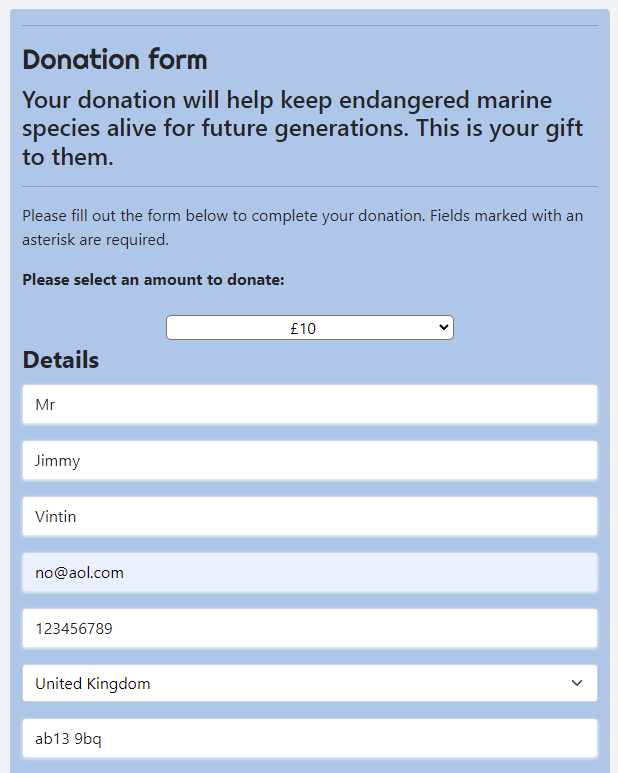
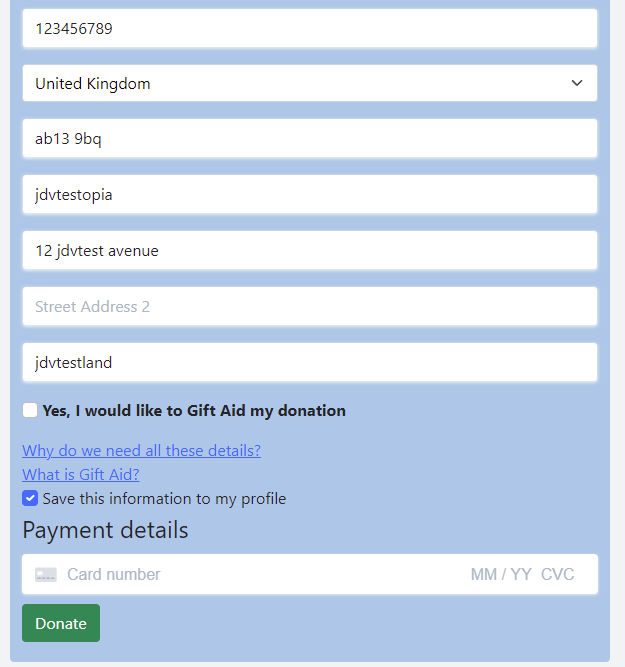
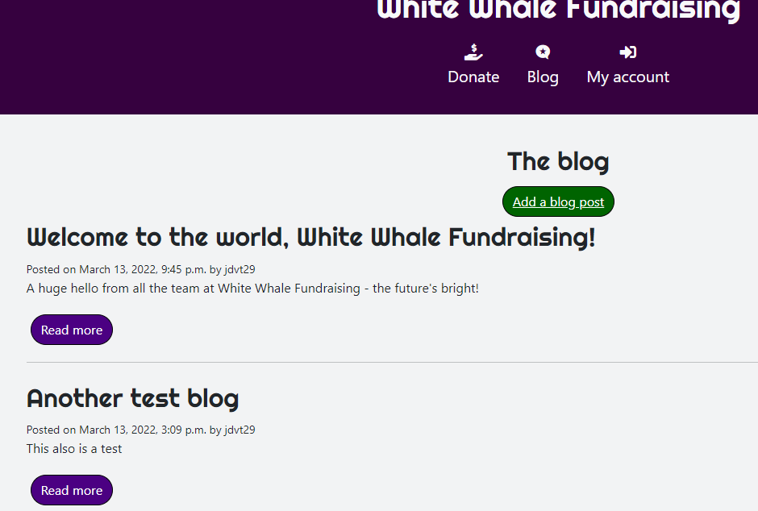
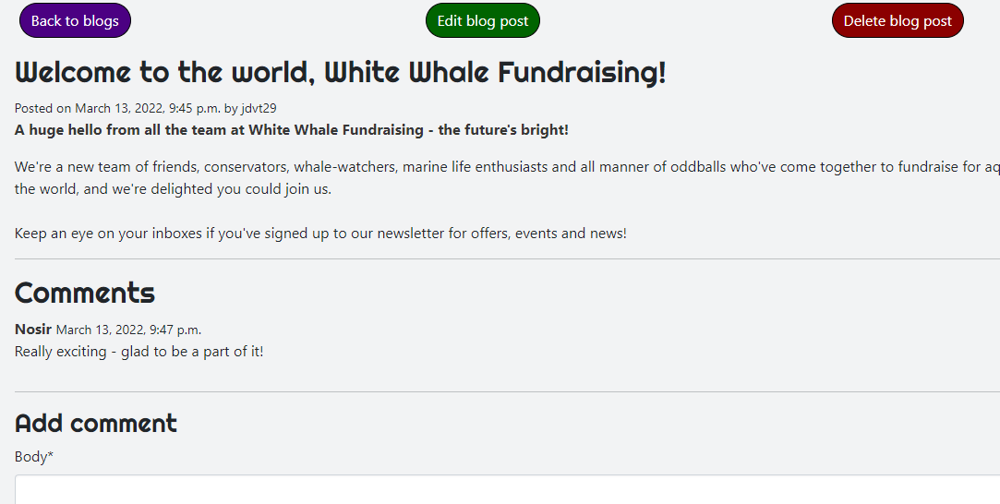

# White Whale Fundraising

This website serves as the main online presence of a charitable fundraising organisation dedicated to the conservation of whales and other sea creatures. Visitors to the site can become members of the organisation for a rolling monthly or annual donation, make one-off donations, and sponsor fundraising activities. Donations for membership are at a fixed amount, while one-off donations and sponsorships can be for any amount. Users can leave public messages for fundraisers whom they have sponsored. The owner(s) of the site will be using it to drive membership subscriptions, generate donations, and raise awareness of fundraising activities.

The GitHub pages version of this site can be accessed by [clicking here.](https://james-vt.github.io/MS4_White_Whale_Fundraising/)

---

# Table of contents

# UX
This site is built to serve as a full-stack ecommerce site for a charitable organisation. It utilises Stripe to allow users to make donations via secure transactions, and is built using the Django framework. Users are able to register an account with the site, with which they can then become paying members if they wish, or make one-off donations or sponsor fundraisers and leave comments of encouragement.

## User stories
### A visitor to the site will want to:
1. Learn about the charity, its goals and its work.
2. Donate money to the charity.
3. Register an account on the site.
4. Have their bank details used only in a secure way, such as that provided by the use of Stripe.
5. Learn about the activities of the charity and its supporters on the blog
6. Make blog posts, which can be edited and deleted.
7. Make comments on blog posts.

### A site owner will want to:
8. Explain to users who they are, what they do and how they can help as soon as a user lands on the home page.
9. Generate revenue via donations.
10. Obtain full user details in order to be able to apply for Gift Aid on their donations.
11. Host a blog.
12. Encourage interaction with users by allowing registered users to leave comments on blogs and write new posts.

---

# Features

## Navigation bar

The header serves as a navigation bar, featuring links to the site's main features. The last of these is for user authentication and account manage. It displays different options depending on whether a user is logged in or out.

* If a user is not logged in:
    * A user can create an account.
    * A user can log into their account.
* If a user is logged in:
    * A user can visit their profile page.
    * A user can log out.

## Profile creation and management

Allauth was used to allow users to register, sign in and manage their profile. The benefit to the site admins from this is that users can store their details for Gift Aid purposes, keep track of their donations, and contribute to the blog.

## Responsive design

Bootstrap and Bulma were used to implement responsive design throughout the site. While efforts have been taken to test the site's responsiveness at different screen sizes, past experience has taught me that there are always outliers so any unintentional whitespace, overhang or general jankiness is the fault of my limited resources. Nonetheless, the methods at my disposal were utilised and I tested the site on three different desktop monitors, a Samsung Galaxy S5 and on the different screen size simulators available in Chrome's dev tools.

## Donation form

The donation form allows users to donate a sum of money to the charity. A series of pre-set donation amounts are available as options. £30 is the highest option. The reason for this is that HMRC will occasionally allow Gift Aid to be claimed on donations from donors who do not qualify for Gift Aid, as long as the donation does not exceed £30. This way the charity can maximise the amount of money they can get from Gift Aid.

* Users can:
    * Choose from a selection of pre-set donation amounts.
    * Choose whether to Gift Aid their donations.
    * Fill in their details so that the charity can apply to have the donation value augmented with Gift Aid. For this reason, all required fields are for data required by HMRC for Gift Aid to be applied.
    * Have their details auto-fill from those in their profile, if they are logged in and have completed same. Likewise, if users are logged in but have not submitted default details, a checkbox allows users to choose whether details they enter onto the form are saved to their profiles.
    * Users do not need to be logged in to donate.

## Blog

The blog features full CRUD functionality. It allows users to read news from the organisation, as well as from other users, and comment on these.

* All users can:
    * Read blog posts.
* Signed-in users can:
    * Write blog posts.
    * Edit their blog posts.
    * Delete their blog posts.
    * Comment on blog posts.

## Admin

Admin is a Django feature allowing a site admin to work in the backend. Superusers have the full range of abilities in the back end

---

# Deployment

Below I include instructions on how to deploy, contribute to and clone this project.

## How to deploy a static project to GitHub pages:

1. You'll need a GitHub account, if you don't already have one. Head to their site https://github.com and you'll see the sign-up links straightaway on the home page. Google Chrome is the recommended browser for GitHub.
2. Once you're signed-up, this'll be your landing page.
3. Click on the user icon in the top right corner of the screen. This opens a dropdown menu. Click "Your repositories."
4. You'll then see a list of your repositories.
5. In the list of repositories, click the repository you want - in this case, White Whale Fundraising.
6. Then, from the bar along the top (not the nav bar - lower, under the repo name) click Settings.
7. On the Settings page, click "Pages" from the left-hand menu.
8. In the Pages options, before you've deployed, your "Branch" under "Source" will have a default value of none. Click this, then set it to Main or Master depending on the version you're using. Mine, having been already deployed, says Master and yours will too when deployed, but ignore that discrepancy for now.
9. Click Save.
10. The page will refresh, and you'll see it change to say "Your site is ready to be deployed at "https://username.github.io/repository-name/"
11. Be aware this deployed site will take a few minutes to deploy, usually about ten. Be patient and don't click while it's building as that can slow it down.
12. Click the link to make sure it works after a suitable wait. Et voila, you've deployed the site!

### Forking the repository for your own use

This creates a copy of the repository for editing or viewing without affecting my (original) version. If you want to do it, do this:

1. You'll need a GitHub account. Go to https://github.com to make one.
2. Locate the repository (this one). At the top right of the page, beneath my pink and white avatar, you'll see the Fork button. Click it.
3. This should add a version for you to use in your own repository. Have fun with it!

### Cloning the repository

Another way of getting your own local version to work on is to clone the repository. Below are the steps.

1. You'll need a GitHub account. Go to https://github.com to make one.
2. Locate the repository (this one).
3. Click Code, the button just to the left of the green GitPod button.
4. Click HTTPS to make sure you're in it, then copy the link you see there.
5. Head into GitPod or your IDE of choice, and open Git Bash.
6. The current working directory needs to be changed to the location you want the cloned one to be.
7. In the CLI, type "git clone" and then the URL you copied earlier.
8. Press enter. Result!

In my own workspace I am using my own secret keys and environment variables; you will need to sort out your own. Also, remember to consult requirements.txt for the project requirements.

## Deploying to Heroku:

Heroku allows us to host Python projects, instead of solely static sites which are all GitHub allows.

### Creating your Heroku app

1. Make an account with Heroku, if you don't already have one, here: https://www.heroku.com/
2. After setting your password and/or logging in, you'll find yourself looking at the Heroku dashboard.
3. You can click your chosen development language for some helpful tips and tutorials about how to use it with Heroku, if that'd help you.
4. From the dashboard, click "Create new app."
5. Enter a name for your app. It must be unique, and contain only letters, numbers and hyphens.
6. Choose a region. In our case, Europe.
7. Click "Create app."
8. From Heroku Resources you'll need Postgres. The free plan will work fine for this.

### Connect your Git repository to Heroku

1. You now want to find the "deploy" tab at the top of the screen.
2. You want to find "Deployment method" and "GitHub" from in there.
3. In the search bar, find your GitHub repo.
4. On the correct repo, click "Connect." DO NOT click to "Enable Automatic Deployment" at this stage. Tried it once. Can't recommend.

TO BE FINISHED

---

# Credits

## Technologies used

* Languages:
    * [HTML5](https://en.wikipedia.org/wiki/HTML5) was used for the content and structure of the site.
    * [CSS3](https://en.wikipedia.org/wiki/CSS#CSS_3) was used for the styling of the site.
    * [JavaScript](https://en.wikipedia.org/wiki/JavaScript) was used for the interactivity of the site.
    * [Python](https://www.python.org/) was used for the back end programming of the site.

* [Django](https://www.djangoproject.com/)
    * Django was used as the framework for the site's back-end development.

* [Pip](https://pip.pypa.io/en/stable/)
    * Pip is the package installer for Python, allowing us to install the packages we need for this site.

* [Jinja](https://www.palletsprojects.com/p/jinja/)
    * Jinja is a templating engine for Python, used to write Flask and other templating services.

* [GitHub](https://github.com/)
    * GitHub is where we host our site.

* [Lighthouse](https://developers.google.com/web/tools/lighthouse)
    * Lighthouse assesses our pages for accessibility, performance and other things.

* [Jigsaw](https://jigsaw.w3.org/css-validator/)
    * Jigsaw validates our CSS for best practices.

* [JSHint](jshint.com)
    * JSHint assesses our Javascript for being practices, bugs, and syntax errors.

* [PEP8 Online](http://pep8online.com/)
    * PEP8 Online checks for errors in out Python code.

* [Am I Responsive?](http://ami.responsivedesign.is/#)
    * This is where we created the header image for this README.

* [favicon](favicon.io)
    * Favicon was used to create the site's favicon.

* [Heroku](https://devcenter.heroku.com/)
    * Heroku is where we deploy this live site. Throughout, we have ensured the version being deployed to Heroku matches our development version by checking features and screen layouts on both versions.

* [Balsamiq](https://balsamiq.com/)
    * Balsamiq was used to create the wireframes for this project. 

* [Git](https://git-scm.com/)
    * Git was used for version control and saving work in the repository, using the GitPod extension in Google Chrome to commit to GitHub.

* [Chrome](https://www.google.com/intl/en_uk/chrome/)
    * This project was created in the Google Chrome browser, and as such Chrome was used as the default testing browser.

* [Google Fonts](https://fonts.google.com/)
    * The fonts for the site were imported from Google Fonts. This site uses Roboto and Just Me Again Down Here throughout.

* [FontAwesome](https://fontawesome.com/)
    * The icons for social media links were taken from FontAwesome.

* [Stripe](https://stripe.com/gb)
    * The payment handling for this site was built using Stripe.

* [Bootstrap](https://getbootstrap.com/)
    * Bootstrap 5 was used for most of the styling on this site.

* [Bulma](https://bulma.io)
    * Bulma was used for some additional styling, particularly the footer.

* [django-llauth](https://django-allauth.readthedocs.io/en/latest/)
    * django-allauth was utilised for the user authentication on the site.

## Tutorials

Tutorials that assisted me with this project include Code Institute's Boutique Ado and Hello Django. I also leaned heavily on Django's own documentation for 3.2, and on [this video from Youtuber Dennis Ivy for the donation app.](https://www.youtube.com/watch?v=oZwyA9lUwRk)

Youtube channel Codemy.com also helped me create this project. Specifically, [this video](https://www.youtube.com/watch?v=CVEKe39VFu8&t=251s)

Others which provided code or inspiration:
https://www.youtube.com/watch?v=AZs4zggS7kA

This one from JustDjango helped with the membership, particularly the views and models:
https://www.youtube.com/watch?v=zu2PBUHMEew

This page also helped with the above, mentioned in memeberships/models.py:
https://levelup.gitconnected.com/building-a-membership-system-in-django-under-5-mins-5efd7e03627d

This video by Youtuber Code With Stein was key to building the blog app:
https://www.youtube.com/watch?v=m3hhLE1KR5Q&t=565s
as did the written version of the guide, here:
https://codewithstein.com/build-a-simple-blog-using-django-3-in-under-20-minutes/
Code and logic were borrowed heavily from these sources for the base blog app.

## People

Fellow student [Suzy](https://github.com/suzybee1987) was once again hugely helpful for many, many questions I had during the making of this project, as was fellow (former) student [Jenny](https://github.com/jennymalmoe) whose repo provided a source of inspiration and answers. Both of these contributed heavily to the code and logic of the blog app, as did fellow (former) student https://github.com/pmeeny whose work provided a lot of inspiration across the project.

For the error pages, the help of fellow students Guillermo Brachetta and Tom Nagy was invaluable. They helped reassure me as to where to locate them and why they weren't working during testing, and with several other issues.

## Websites

Several websites with similar features were helpful to understand what sort of information might be seen on a typical charity website, for example form fields, membership types, etc. In particular, the websites of the Royal Armouries, the National Funding Scheme, and the National Trust influenced my decisions on layouts, styling and orders. Credit inevitably also goes to StackOverflow and to Code Institute's Slack for a constant resource of information and answers.

## Images

whalelighthousebanner.jpg is an open source image taken from Wikimedia Commons. Attribution: Gillfoto, CC BY-SA 3.0 <https://creativecommons.org/licenses/by-sa/3.0>, via Wikimedia Commons

whitewhaleicon.jpg is is an open source image taken from Wikimedia Commons. Attribution: Tris T7, CC BY-SA 4.0 <https://creativecommons.org/licenses/by-sa/4.0>, via Wikimedia Commons

eilatdolphinreef.jpg is an open source image taken from Wikimedia Commons. Attribution: טל שמע, CC BY-SA 4.0 <https://creativecommons.org/licenses/by-sa/4.0>, via Wikimedia Commons

pinkanemonefish.jpg is an open source image taken from Wikimedia Commons. Attribution: טל שמע, CC BY-SA 4.0 <https://creativecommons.org/licenses/by-sa/4.0>, via Wikimedia Commons

caribbeanreefsquid.jpg is an open source image taken from Wikimedia Commons. Attribution: טל שמע, CC BY-SA 4.0 <https://creativecommons.org/licenses/by-sa/4.0>, via Wikimedia Commons

happyfish.jpeg is an open source image taken from Wikimedia Commons. Attribution: Bahurel Hernandez, CC BY 3.0 <https://creativecommons.org/licenses/by/3.0>, via Wikimedia Commons