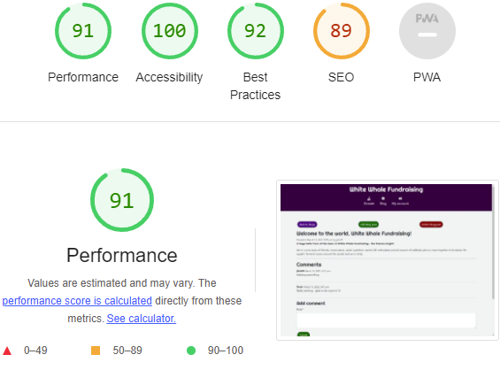
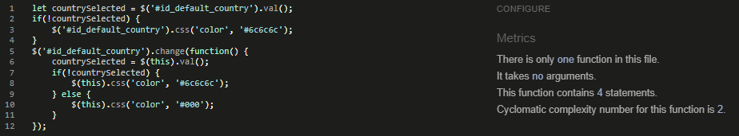

# Testing

Here I will document the testing processes and bugs I encountered during the production of this project.

# Feature testing

## Donation form

### Donation form - Passing information through to the database

Before linking Stripe to the project to take payments, I wanted to test that information was passing through properly to the database and that donation forms were being saved correctly. I had experienced a lot of problems building the form, so this was an important step.

I filled out the form with info:


Then, upon clicking submit, I checked to see whether this had appeared in the database:


Success! It had done so. As an aside, I had used a couple of print statements in the view as part of the bugfixing process and the results can be seen here:


### Donation form - Auto-filling data from the user profile to the donation form

As a logged-in user, information should be able to be saved to the user profile and auto-filled to the donation form from there. To test that this worked, I created a new user and entered the details info the relevant fields on the user profile page.


Then I navigated to the donation form to see whether the information was appearing there as expected.


Success! The data carried through correctly.

### Donation form - Saving data from the donation form to the user profile.

A setting on the donation form allows a user whether to choose to update their default profile information with the information they enter into the form. If this option is selected, then any information on the form should carry through to - or overwrite - the relevant fields in their profile. To test that this worked, I used the same user as above - "Nosir" - and made another donation, this time changing certain fields.

Here is the profile information as it was:


I then navigated to the donation form and entered new information there:


The save_info box was checked, meaning the information should be saved to the profile. I then navigated to the profile to make sure:


Success! The data was saved correctly to the user profile.

### Linking the donation form with Stripe and the database

To test the experience for a guest user (i.e. one who is not signed in) and to make sure information is being passed successfully through to both Stripe and our database at the same time, I filled in the form with the following information:


To test these features, we can then click the donate button and check the information in the database and Stripe.

First, we see our success page, so we know that this works, at least:


Then we can go to our site admin and check to make sure the donation is recorded there:


Great. We know that donations are passing through to the site admin, even from non-signed in users.

Now we check our Stripe dashboard:


And there it is! Success.

| User story goal met by this feature | How was this achieved? |
| --- | --- |
| Donate money to the charity | The site's donation form takes donations from users |
| Generate revenue via donations | The donation form on the site allows users to donate money to the organisation |
| Have their bank details used only in a secure way, such as that provided by the use of Stripe | Stripe handles payments from users and guarantees the secure handling of payment details so that these do not need to be stored anywhere in the site's code or the administration |

---

# Testing against user stories

In this section we will test each user story against the features of the site to ensure that every one is met. Although some user stories are already mentioned in the feature testing above, I present this as something of a summary to serve as a check list that all user needs are met for certainty's sake.

A visitor to the site will want to:
| A user will want to: | How was this achieved? | Evidence of user story having been met |
| --- | --- | --- |
| Learn about the charity, its goals and its work. | On the landing page, a piece of text immediately explains to the user what the site and the organisation are about. Also, a user can visit the blog without having to be logged in, and learn more from the posts there if there are any. | [Image of a blog post](assets/features/blogcrudview.png), [Image of the list of blog posts](assets/features/blogpostsview.png), [Image of the landing page text](assets/testing/donationformtesting/landingtext.png) |
| Donate money to the charity. | The site features a donation app that allows users to select from a number of pre-set donation amounts. | [Image of donation form](assets/testing/donationformtesting/filledform1.png), [Image of lower half of donation form](assets/testing/donationformtesting/donationformnewinfo.png) |
| Register an account on the site. | allauth is used to allow users to log into the site and manage their accounts. It handles authentication and authorisation. | [Image of the sign in form](assets/features/signinform.png), [Image of the register account form](assets/features/registerform.png) |
| Have their bank details used only in a secure way, such as that provided by the use of Stripe. | Stripe ensures that no bank details need be retained in the code or in the database. | [Example image of a Stripe transaction](assets/testing/donationformtesting/stripedashboardcakeuser.png)
| Learn about the activities of the charity and its supporters on the blog | The blog can be used by site owners and registered users to share news and information | [Image of the blog list](assets/features/blogpostsview.png)
Make blog posts, which can be edited and deleted. | The blog features full CRUD functionality; users can create, read, edit and delete. | [Image of CRUD functionality in the blog](assets/features/blogcrudview.png)
Make comments on blog posts. | Comments can be made on blog posts by registered users. | [Image of the blog comment form](assets/features/blogcommentform.png)

A site owner will want to:
| A user will want to: | How was this achieved? | Evidence of user story having been met |
| --- | --- | --- |
| Explain to users who they are, what they do and how they can help as soon as a user lands on the home page. | Landing text on the homepage relays these things. | [Image of the home page landing text](assets/features/landingtext.png)
| Generate revenue via donations. | Donation form allows users to donate to the organisation | [Image of donation form](assets/testing/donationformtesting/filledform1.png), [Image of lower half of donation form](assets/testing/donationformtesting/donationformnewinfo.png) |
| Obtain full user details in order to be able to apply for Gift Aid on their donations. | Users can opt-in to Gift Aid on each donation they make, and they can save their details by logging in. | [Bottom half of donation form, showing gift aid and save details buttons](assets/features/donationformbottomhalf.png)
| Host a blog. | A blog is hosted on the site. | [Image of CRUD functionality in the blog](assets/features/blogcrudview.png), [Image of the blog list](assets/features/blogpostsview.png)
| Encourage interaction with users by allowing registered users to leave comments on blogs and write new posts. | Home page landing text invites users to visit the blog, and full CRUD features are available  | [Image of CRUD functionality in the blog](assets/features/blogcrudview.png), [Image of the blog list](assets/features/blogpostsview.png), [Image of the blog comment form](assets/features/blogcommentform.png), [Image of the home page landing text](assets/features/landingtext.png)

---

# Validators

## Lighthouse

Lighthouse is a validator built in to Google Chrome, used to test for performance, best practice, SEO and, most importantly for us, accessibility. For this project I haven't worried too much about performance as we're using Stripe, which a number of fellow students have reported hammered their performance scores. Accessibility is the number one priority, and I have tried to remember best practices for this throughout development.

Home page


Donation form


Blog


Add blog post form


View blog post detail



Edit blog post form


Allauth templates (scores all within one or two points of this)


Profile view


## W3C CSS Validator

W3C CSS Validator does what you'd expect - it validates CSS. As I validated via the copy and paste method, the evidence is flimsy. Nonetheless, I attach an image that is indicative of the results of all of them and I invite the doubter to run the test themselves by copying and pasting any of my CSS code here: https://jigsaw.w3.org/css-validator/#validate_by_input


## JSHint

JSHInt validates JavaScript, checking for errors, unnecessary semicolons, unused variables and such.

donations.js results


stripe_elements.js results had a couple of notices, both of which related to information being passed between the front and back ends, thus they remain.


profiles.js results



toasts.js results had a couple of notices, both of which were to do with how Bootstrap does its toast thing so we must endeavour to persevere.


---

# Bugs

## Membership Level Bug

While working on my first model, I encountered a bug whereby the model for selecting the different levels of membership did not properly show itself in the site admin. Instead, this was what was visible:


My code for this section looked like this:

```
class MembershipLevel(models.Model):
    """Defines the level of a member's subscription"""
    GOLD = 'GO'
    SILVER = 'SI'
    BRONZE = 'BR'
    MEMBERSHIP_CHOICES = [
        (GOLD, 'Gold Level'),
        (SILVER, 'Silver Level'),
        (BRONZE, 'Bronze Level'),
    ]

    sku = models.CharField(max_length=254, null=True, blank=True)
    description = models.TextField()
    price = models.DecimalField(max_digits=6, decimal_places=2)
```

With help from an alumnus at Code Institute, I was able to fix the relevant parts of this code to the following:

```
MEMBERSHIP_CHOICES = (
    ('Gold', 'Gold Level'),
    ('Silver', 'Silver Level'),
    ('Bronze', 'Bronze Level')
)


class Membership(models.Model):
    """ Class for memberships """
    membership_level = models.CharField(
        max_length=6,
        choices=MEMBERSHIP_CHOICES,
        default='Bronze',
    )
    price = models.DecimalField(max_digits=6, decimal_places=2)
    description = models.TextField()

    def __str__(self):
        return self.membership_level
```

The choices variable was moved to outside the class, and the __str__ function was edited not to return name, but the membership_level constructed. This fixed the issue. However, in the end I went with a different option so that admins could create new membership types as needed. This was done in order to future-proof the site against the evolving needs of the charity. Thus the choices field was removed, and replaced with a simple CharField. I leave this here to demonstrate what I have learned from attempting to implement this idea.

---

## Donation form JavaScript bug

While building this project's donation form, I wanted to provide donors with a list of options for amounts they could donate, while also giving them the option to manually enter an amount. The pre-set donation amount options were selected via a radio menu, while the custom amount input was a text field. However, this posed a potential problem. Users needed to have the option to change their minds and donate a specific sum instead of a pre-set amount, but if they had selected a pre-set amount then, due to the nature of radio inputs, they could not uncheck a pre-set amount without selecting another pre-set amount. To get around this, I attempted to write a script that would uncheck any checked radio input when a user clicked inside the custom donation input field. I wrote it in a separate JS document and linked it in the `````` block near the top of the donation_form.html file. At first, I could not get this to work. The script I wrote looked like this:

```
var amountCustom = document.getElementById('amount-custom');

amountCustom.addEventListener("click", uncheckRadio);

function uncheckRadio() {
    var radio = document.querySelector('input[type=radio]:checked');
    radio.checked = false;
    }
```

It did not work. The error it flagged said that it could not read the property of null, citing the element with ID 'amount-custom' as null on the third line, when trying to add the event listener. To fix this, I first tried getting, and adding the event listener to, the outer div containing the text input, but the same problem occurred again. Then, remembering the different results I had encountered when loading my JavaScript at different positions in the HTML file while working on my Gloucestershire Battlefields project, I added the same script directly inline into the HTML file, at the very bottom. Lo and behold, this worked. The null error disappeared, and clicking inside the text input unchecked any checked radio input. As a result, I removed the inline script and moved my JavaScript file link into a new `````` at the bottom of the file.

This worked nicely, apart from one small problem. A console error was logged if a user clicked inside the text input while no radio input was checked. The reason for this was that the first line of the function was trying to asign something to a variable every time the text input was clicked, but that thing - a checked radio input - did not exist if a user hadn't selected one. My solution to this was to wrap the function's inner workings inside an if statement. The result was this:

```
var amountCustom = document.getElementById('amount-custom');

amountCustom.addEventListener("click", uncheckRadio);

function uncheckRadio() {

    if (document.querySelector('input[type=radio]:checked')) {
        var radio = document.querySelector('input[type=radio]:checked');
        radio.checked = false;
    }
}
```

This works with no console errors. Success!

NOTE: All of this was later removed as crispy forms proved unsuitable to the task of pairing radio options' values with labels that were at once user-friendly and database-friendly. There was also an issue with the donation total field not accurately gathering user input from one or the other input field. As tutor support was unable to help with these issues, I was forced to take a different approach and use a drop-down menu for pre-set amounts instead. I leave this section here to demonstrate work done and learning; in the future I would like to revisit this project and have another go at implementing these things.

---

